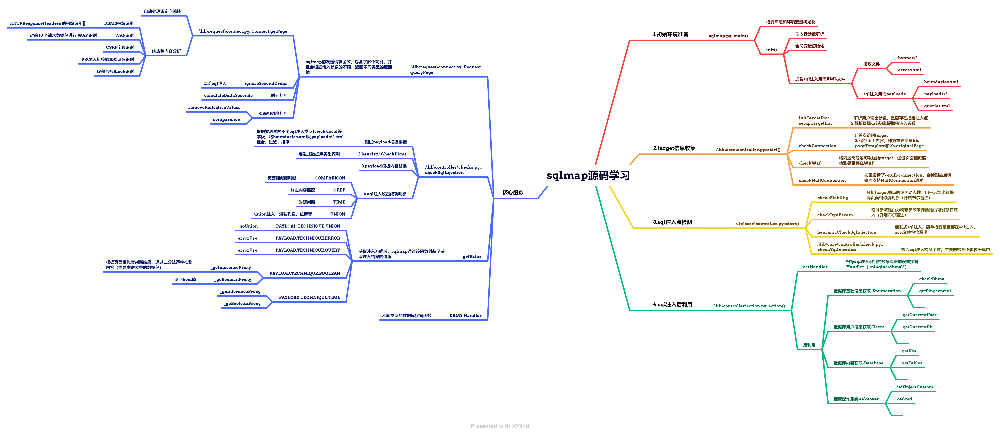

# sqlmap工具学习 

​	笔者对于 sqlmap 的部分源码详细分析笔记存放于[sqlmap源码分析](https://notes.surfrid3r.top/Security/Web/SQL%E6%B3%A8%E5%85%A5/Sqlmap/sqlmap%E6%BA%90%E7%A0%81%E5%88%86%E6%9E%90/)此处，该文章的主要目的是归纳，总结，只会列举一些笔者觉得可以借鉴的点。

## sqlmap检测流程

sqlmap的主要流程如下，详细可见笔记。



## sqlmap的核心函数

在分析sqlmap时会发现存在几个函数非常重要，在sqlmap的各个阶段都能够看见存在调用，详见[sqlmap核心函数分析](https://notes.surfrid3r.top/2023/02/07/sqlmap%E6%BA%90%E7%A0%81%E5%88%86%E6%9E%90/)：

## sqlmap的核心技术

### sqlmap的指纹识别

sqlmap整个流程中有收集target站点信息以及多种类型的指纹，每一种指纹类型都是为了帮助 sqlmap 在后续的不同sql注入类型测试中去降低发送payload的测试范围，能够更加快速的完成注入检测。主要的指纹类型识别有如下几大类：

- 操作系统
- WAF类型

- 服务器类型
- DBMS数据库类型

接下来分析这几种指纹，sqlmap 是如何识别的。

#### 操作系统、DBMS和服务器指纹识别

sqlmap 关于操作系统和服务器指纹的识别在[conet.queryPage](https://notes.surfrid3r.top/2023/02/12/sqlmap%E6%A0%B8%E5%BF%83%E5%87%BD%E6%95%B0%E5%88%86%E6%9E%90/#2-process-response)函数中。sqlmap 在收发数据包时会进行响应内容的指纹识别，并且识别出的目标指纹信息更新到`kb.headersFp`全局变量中。

##### 基于HTTP header的指纹识别

其对应的指纹文件位于 `sqlmap/data/xml/banner/` 路径下，主要的如下（主要是基于 HTTP Header的指纹识别）：

- `sharepoint.xml` - 识别 SharePoint 服务器
- `server.xml` -识别各种类型服务器和操作系统（IIS, Apache, Nginx, GoogleWebServer, lighttpd, OpenResty, LiteSpeed, SunONE）* (Windows，各种类型的 Linux 操作系统)
- `servlet-engine.xml` - 识别 Java Servlet 中间件
- `set-cookie.xml` - 通过 cookie 参数类型识别语言或者 CMS
- `x-aspnet-version.xml` - 识别 ASP. NET 版本
- `x-powered-by.xml` - 通过 x-powered-by 识别语言或者 CMS
- `generic.xml` - 通用的字段，会尝试匹配所有的 Headers，主要是识别操作系统

##### 基于HTTP ResponseBody的指纹识别

不同于上述的指纹识别，基于响应包内容的识别是针对报错信息的识别。sqlmap 先通过简单的正则`SQL (warning|error|syntax)`匹配，再同`errors.xml`中的数据库指纹信息匹配，主要是用来识别DBMS类型的。

- `errors.xml` - 识别 DMBS 类型

##### sql注入后的DBMS版本识别

为了能够再后利用中更加精准的查询，sqlmap 在除了识别 DMBS 的类型后，还会尽可能的去识别 DBMS 的具体版本类型（因为版本差距较大的数据库往往可能函数甚至是库都是不同的）。以 `mysql` 为例，sqlmap 是测试不同 `mysql` 版本的特性语句或者数据库是否存在来推测数据库的大致版本范围（详见 [checkDbms函数](https://notes.surfrid3r.top/2023/02/12/sqlmap%E6%A0%B8%E5%BF%83%E5%87%BD%E6%95%B0%E5%88%86%E6%9E%90/#check-dbms)）


#### WAF指纹识别

1. sqlmap 本身是存在 WAF 检测函数即 check_waf()，该函数的功能非常弱，只能够检测是否存在 WAF，不具备 WAF 类型指纹的识别，其主要原理是通过发送一段明显恶意的 payload，然后判断响应包内容和正常请求的响应页面的相似度是否小于`IPS_WAF_CHECK_RATIO = 0.5`，若满足 sqlmap 会认为存在 WAF，之后便会推荐你使用 tamper 脚本进行绕过。（详见[checkWaf分析](https://note.surfrid3r.top/Security/Web/SQL%E6%B3%A8%E5%85%A5/Sqlmap/sqlmap%E6%BA%90%E7%A0%81%E5%88%86%E6%9E%90/#2-1-6-check-waf)）

   ```python
   IPS_WAF_CHECK_PAYLOAD = "AND 1=1 UNION ALL SELECT 1,NULL,'<script>alert(\"XSS\")</script>',table_name FROM information_schema.tables WHERE 2>1--/**/; EXEC xp_cmdshell('cat ../../../etc/passwd')#"
   payload = "%d %s" % (randomInt(), IPS_WAF_CHECK_PAYLOAD)
   place = PLACE.GET
   if PLACE.URI in conf.parameters:
       value = "%s=%s" % (randomStr(), agent.addPayloadDelimiters(payload))
   else:
       value = "" if not conf.parameters.get(PLACE.GET) else conf.parameters[PLACE.GET] + DEFAULT_GET_POST_DELIMITER
       # 随机生成一段randstr()=payload进行参数拼接
       value += "%s=%s" % (randomStr(), agent.addPayloadDelimiters(payload))
   ```

2. sqlmap 能够识别 WAF 指纹的功能其实属于第三方插件，主要功能代码位于 `sqlmap\thirdparty\identywaf` 下，其来源是该 Github 上的仓库: https://github.com/stamparm/identYwaf。sqlmap 默认会在前10个响应数据包中，去匹配`data,json`中各类 WAF 的 regex正则规则，如果命中则判断存在对于类型 WAF。

   ```json
   "airlock": {
   		"company": "Phion/Ergon",
   		"name": "Airlock",
   		"regex": "The server detected a syntax error in your request",
   		"signatures": ["3e2c:RVZXu261OEhCWapBYKcPk4JzWOtohM4IiUcMr2RXg1uQJbX3uhdOn9htOj+hX7AB16FcPxJPdLsXomtKaK59n+i6c4RmkwI2FZjxtDtAeq6c36A5chW1XaTD"]
   	},
   ```


3. 此外，还存在`signatures`字段，sqlmap并没有使用该字段。该字段相关资料可以参考：https://www.slideshare.net/stamparm/blind-waf-identification。顺便分析了一下`identYwaf`对该字段的使用。（详见[identYwaf signature分析](https://notes.surfrid3r.top/2023/04/05/identYwaf/#signatures)）

   ```python
   # Check if it is MySQL >= 5.1.2 and < 5.5.0
   elif inject.checkBooleanExpression("@@table_open_cache=@@table_open_cache"):
   	if inject.checkBooleanExpression("[RANDNUM]=(SELECT [RANDNUM] FROM information_schema.GLOBAL_STATUS LIMIT 0, 1)"):
   		Backend.setVersionList([">= 5.1.12", "< 5.5.0"])
   	elif inject.checkBooleanExpression("[RANDNUM]=(SELECT [RANDNUM] FROM information_schema.PROCESSLIST LIMIT 0, 1)"):
   		Backend.setVersionList([">= 5.1.7", "< 5.1.12"])
   	elif inject.checkBooleanExpression("[RANDNUM]=(SELECT [RANDNUM] FROM information_schema.PARTITIONS LIMIT 0, 1)"):
   		Backend.setVersion("= 5.1.6")
   	elif inject.checkBooleanExpression("[RANDNUM]=(SELECT [RANDNUM] FROM information_schema.PLUGINS LIMIT 0, 1)"):
   		Backend.setVersionList([">= 5.1.5", "< 5.1.6"])
   	else:
   		Backend.setVersionList([">= 5.1.2", "< 5.1.5"])
   # ...
   ```

   

### sqlmap的Request.queryPage函数

`Request.queryPage` 函数是 sqlmap 中重要的请求函数，所有的发送请求函数都是调用该接口。在 sqlmap 源码中看到有大量的使用，因此该函数的分析是非常重要（详见[Request.queryPage](https://notes.surfrid3r.top/2023/02/12/sqlmap%E6%A0%B8%E5%BF%83%E5%87%BD%E6%95%B0%E5%88%86%E6%9E%90/#request-query-page)），此处仅作标记。


### sqlmap的一些检测

- sqlmap会对网站的动态性进行检测，目的是为了提高页面相似度判断的准确率，详见[checkStability](https://notes.surfrid3r.top/2023/02/20/sqlmap%E7%9A%84%E9%A1%B5%E9%9D%A2%E7%9B%B8%E4%BC%BC%E5%BA%A6%E5%88%A4%E6%96%AD/#check-stability)
- sqlmap会对网站中的动态元素（广告等）进行检测，并且在相似度比较时会去除掉这些动态元素（removeDynamicContent），详见[findDynamicContent](https://notes.surfrid3r.top/2023/02/20/sqlmap%E7%9A%84%E9%A1%B5%E9%9D%A2%E7%9B%B8%E4%BC%BC%E5%BA%A6%E5%88%A4%E6%96%AD/#find-dynamic-content)
- sqlmap会对url参数进行检测，如果时静态参数就不会对该参数进行sql注入测试，详见[checkDynParam](https://notes.surfrid3r.top/2023/02/07/sqlmap%E6%BA%90%E7%A0%81%E5%88%86%E6%9E%90/#2-2-1-check-dyn-param)
- 如果开启`--null-connection`用于加速检测，sqlmap 还会进行 [checkNullConnection](https://notes.surfrid3r.top/2023/02/07/sqlmap%E6%BA%90%E7%A0%81%E5%88%86%E6%9E%90/#2-1-7-check-null-connection).checkNullConnection是一种能大量节省带宽的测试方法，不接收响应Body，只通过HTTP Header中返回的`Content-Length`或者`Range`字段来获取响应Body长度，从而判断是否输入成功。（能够支持的该类检测的只有布尔盲注）

### sqlmap的payload

#### payload过滤

sqlmap 的测试 payload 模板均位于`.\data\xml\payloads\boolean_blind.xml`目录下，数量是非常庞大的。并且一个 payload 模板往往需要花费的不只是一个请求数据包，而是数十个甚至上百个。那么一次性全部发送不然是不行的，非常耗时，sqlmap 在具体测试会使用许多过滤条件来尽可能的减少无意义 payload 的发送数量。下面列举一些 sqlmap 过滤 payload 的方式

- 通过`risk` 和 `level` 命令行参数控制，不同`risk`和`level`等级的 payload 的检测位置和需要测试的请求包都是不一样的（详见[sqlmap的level和risk等级定义](https://notes.surfrid3r.top/2023/02/12/sqlmap%E7%9A%84level%E5%92%8Crisk%E7%AD%89%E7%BA%A7%E5%AE%9A%E4%B9%89/)）
- 通过指纹的识别，只使用对应 DBMS 类型的 payload 测试。
- 如果别的类型的sql注入已经测试成功，那么测试不同类型的sql注入时不会使用相同`<clause>`标签的payload.

#### payload模板

sqlmap 的 payload 由两部分组成： `boundaries.xml`中的界定符 和 `payloads/*.xml`中的各类sql注入的 payload模板（详见[sqlmap的xml文件](https://notes.surfrid3r.top/2023/02/26/sqlmap%E7%9A%84XML%E6%96%87%E4%BB%B6/)）。这些都位于XML文件中。

1. 其中 payload 还包含大量的特殊字符串，用于在生成模板的时候进行替换，主要包含积累：

- 随机字符
- 分隔符（用于在报错注入等回显型注入的时候在响应包中匹配内容）
- 时延
- 注释符
- 后利用语句标记（`[INFERENCE]`）

2. xml 文件中还包含了对应payload是否攻击成功的判定（详见[sqlmap的xml文件](https://notes.surfrid3r.top/2023/02/26/sqlmap%E7%9A%84XML%E6%96%87%E4%BB%B6/)）


不过这里需要注意的是其中两种类型中的`where`标签，`where`标签分为三种数值，这决定了如何处理原始参数后的数值同 sqlmap 添加的 payload的关系，是直接拼接，取负后拼接还是替换，这是会影响后续sql注入效果的。

1. 将注入 payload 添加到注入参数的原始数值前。
2. 将注入参数的原始数值替换为一个负随机值并在这之后添加注入
3. 用 payload 替换掉注入参数的原始数值。


#### payload编码绕过

1. 实际测试中，可以看到从xml中渲染的 payload 到 sqlmap 真实发送给目标站点的 payload,其实对内容进行了hex、base64编码等操作。

   - base64编码、特殊字符的替换和编码详见：[ajustLateValues函数](https://notes.surfrid3r.top/2023/02/12/sqlmap%E6%A0%B8%E5%BF%83%E5%87%BD%E6%95%B0%E5%88%86%E6%9E%90/#adjust-late-values)

   - hex等编码，sqlmap 默认存在`Syntax`类，位于`sqlmap\plugins\generic\syntax.py`,在发送payload之前该函数会被调用。

     ```Python
     class Syntax(object):
         """
         This class defines generic syntax functionalities for plugins.
         """
     
         def __init__(self):
             pass
     
         @staticmethod
         def _escape(expression, quote=True, escaper=None):
             retVal = expression
             # 编码所有单引号的中文本内容
             if quote:
                 for item in re.findall(r"'[^']*'+", expression):
                     original = item[1:-1]
                     if original:
                         if Backend.isDbms(DBMS.SQLITE) and "X%s" % item in expression:
                             continue
                         if re.search(r"\[(SLEEPTIME|RAND)", original) is None:  # e.g. '[SLEEPTIME]' marker
                             replacement = escaper(original) if not conf.noEscape else original
     
                             if replacement != original:
                                 retVal = retVal.replace(item, replacement)
                             elif len(original) != len(getBytes(original)) and "n'%s'" % original not in retVal and Backend.getDbms() in (DBMS.MYSQL, DBMS.PGSQL, DBMS.ORACLE, DBMS.MSSQL):
                                 retVal = retVal.replace("'%s'" % original, "n'%s'" % original)
             else:
                 retVal = escaper(expression)
     
             return retVal
     
         @staticmethod
         def escape(expression, quote=True):
             errMsg = "'escape' method must be defined "
             errMsg += "inside the specific DBMS plugin"
             raise SqlmapUndefinedMethod(errMsg)
     ```

     并且当确认了具体的DMBS类型，会设置对应的handler,`.\plugins\dbms\*`下每个数据库也会重写该 escape 函数，以 mysql 为例如下。mysql将引号内字符进行16进制编码。

     ```python
     class Syntax(GenericSyntax):
         @staticmethod
         def escape(expression, quote=True):
             """
             >>> Syntax.escape("SELECT 'abcdefgh' FROM foobar") == "SELECT 0x6162636465666768 FROM foobar"
             True
             >>> Syntax.escape(u"SELECT 'abcd\xebfgh' FROM foobar") == "SELECT CONVERT(0x61626364c3ab666768 USING utf8) FROM foobar"
             True
             """
     
             def escaper(value):
                 if all(_ < 128 for _ in getOrds(value)):
                     return "0x%s" % getUnicode(binascii.hexlify(getBytes(value)))
                 else:
                     return "CONVERT(0x%s USING utf8)" % getUnicode(binascii.hexlify(getBytes(value, "utf8")))
     
             return Syntax._escape(expression, quote, escaper)
     ```

     

2. 另外 sqlmap 还支持 tamper 脚本，对 payload 进行二次处理从而尝试进行针对性绕过,详见[payload函数](https://notes.surfrid3r.top/2023/02/12/sqlmap%E6%A0%B8%E5%BF%83%E5%87%BD%E6%95%B0%E5%88%86%E6%9E%90/#payload)

### sqlmap的sql注入攻击成功检测

为了检测SQL注入攻击是否成功，sqlmap需要根据相应的payload结果进行判断。不同类型的payload判断方式不同，而这些判断方式都写在`payloads/*.xml`的单个payload文件中。sqlmap主要分为以下四种判断类型：

- 时间盲注
- 布尔盲注
- 报错注入和内联注入
- Union注入

#### 时间盲注

时间盲注的 payload 位于`time_blind.xml`中,以其中一个为例来说明 sqlmap 的时间盲注检测逻辑。首先是对应的 payload 模板如下：

```xml
<test>
    <title>MySQL &gt;= 5.0.12 AND time-based blind (query SLEEP)</title>
    <stype>5</stype>
    <level>1</level>
    <risk>1</risk>
    <clause>1,2,3,8,9</clause>
    <where>1</where>
    <vector>AND (SELECT [RANDNUM] FROM (SELECT(SLEEP([SLEEPTIME]-(IF([INFERENCE],0,[SLEEPTIME])))))[RANDSTR])</vector>
    <request>
        <payload>AND (SELECT [RANDNUM] FROM (SELECT(SLEEP([SLEEPTIME])))[RANDSTR])</payload>
    </request>
    <response>
        <time>[SLEEPTIME]</time>
    </response>
    <details>
        <dbms>MySQL</dbms>
        <dbms_version>&gt;= 5.0.12</dbms_version>
    </details>
</test>
```

可以看到发送的 payload 位于 `request.payload` 中，而检测逻辑则位于 `reponse`中。该 payload 如果攻击成功（还要加上`boundaries.xml`中的分隔符），则会产生`SLEEPTIME`秒时延，如果满足条件则认为 对应的 payload + 对应的 boundary 组合的payload模板即为注入点。具体的检测逻辑详见[sqlmap_time](https://notes.surfrid3r.top/2023/02/12/sqlmap%E6%A0%B8%E5%BF%83%E5%87%BD%E6%95%B0%E5%88%86%E6%9E%90/#time)。

另外，如果没有手动设置`--timeSec`参数，sqlmap将计算站点的平均响应时长，并且会持续更新以防止异常的网络波动对检测造成大量干扰。在进行时间盲注检测之前，sqlmap通常会发送至少30个数据包，并以队列形式保存这些响应时间（最多不超过200个）。如果当前响应时间超过了 `MAX(MIN_VALID_DELAYED_RESPONSE, 平均时延+7 * deviation)` 的时长（`MIN_VALID_DELAYED_RESPONSE`=0.5），则sqlmap会判断该请求存在时延。

#### 布尔盲注

布尔盲注的 payload 位于`boolean_blind.xml`,同样以其中一个为例说明：

```XML
<test>
    <title>AND boolean-based blind - WHERE or HAVING clause</title>
    <stype>1</stype>
    <level>1</level>
    <risk>1</risk>
    <clause>1,8,9</clause>
    <where>1</where>
    <vector>AND [INFERENCE]</vector>
    <request>
        <payload>AND [RANDNUM]=[RANDNUM]</payload>
    </request>
    <response>
        <comparison>AND [RANDNUM]=[RANDNUM1]</comparison>
    </response>
</test>
```

可以看到`request.payload`和`request.comparison`会生成两种payload，并且逻辑上是相反。sqlmap 正是会判断这两种页面的相似度来判断是否攻击成功，详见[sqlmap_comparison](https://notes.surfrid3r.top/2023/02/12/sqlmap%E6%A0%B8%E5%BF%83%E5%87%BD%E6%95%B0%E5%88%86%E6%9E%90/#comparison)。

##### 页面相似度判断

另外值得一说的就是sqlmap对应页面相似的判断逻辑，详见[sqlmap 的页面相似度判断](https://notes.surfrid3r.top/2023/02/20/sqlmap%E7%9A%84%E9%A1%B5%E9%9D%A2%E7%9B%B8%E4%BC%BC%E5%BA%A6%E5%88%A4%E6%96%AD/)。在判断页面相似度前，sqlmap 会响应页面内容进行了大量的排除无意义内容来提高正确率：

- 检测网站动态型，尝试去除掉动态元素
- 即去除掉 HTML 中的 script, style 和 comment 等标签内容，提取纯文本标签中的内容。

- 对于高动态页面会调用更精准的相似度计算函数
- sqlmap 会不断根据历史请求调整相似度的阈值。

#### 报错注入和内联注入

报错注入和内联注入的检测逻辑比较检测，以其中一个为例：

```XML
<test>
    <title>Generic inline queries</title>
    <stype>3</stype>
    <level>1</level>
    <risk>1</risk>
    <clause>1,2,3,8</clause>
    <where>3</where>
    <vector>(SELECT CONCAT(CONCAT('[DELIMITER_START]',([QUERY])),'[DELIMITER_STOP]'))</vector>
    <request>
        <payload>(SELECT CONCAT(CONCAT('[DELIMITER_START]',(CASE WHEN ([RANDNUM]=[RANDNUM]) THEN '1' ELSE '0' END)),'[DELIMITER_STOP]'))</payload>
    </request>
    <response>
        <grep>[DELIMITER_START](?P&lt;result&gt;.*?)[DELIMITER_STOP]</grep>
    </response>
</test>
```

`request.payload`和`response.grep`中包含两个特殊字符`DELIMITER_START`和`[DELIMITER_STOP]`，这些特殊字符被用作分割符。在发送payload之前，sqlmap会替换这些特殊字符为随机字符。如果注入成功，响应包中会存在与分割符包裹的查询结果，因此可以使用`response.grep`生成的正则表达式进行匹配，具体的检测逻辑详见[sqlmap_grep](https://notes.surfrid3r.top/2023/02/12/sqlmap%E6%A0%B8%E5%BF%83%E5%87%BD%E6%95%B0%E5%88%86%E6%9E%90/#grep)。

#### Union注入

union注入的攻击成功判别比较复杂，sqlmap 在这个过程中不仅会判断是否可能存在Union注入，还存进行推测注入点所在的具体位置，因此会消耗大量的数据包进行推测。以其中一个为例(需要说明的是`union_query.xml`中的 payload 模板都非常相似，一般只有`columns`和`char`两个标签的区别，即不同的推测列数范围和使用字符。)，详见[sqlmap_union](https://notes.surfrid3r.top/2023/02/12/sqlmap%E6%A0%B8%E5%BF%83%E5%87%BD%E6%95%B0%E5%88%86%E6%9E%90/#union)。

```XML
<test>
    <title>Generic UNION query ([CHAR]) - [COLSTART] to [COLSTOP] columns (custom)</title>
    <stype>6</stype>
    <level>1</level>
    <risk>1</risk>
    <clause>1,2,3,4,5</clause>
    <where>1</where>
    <vector>[UNION]</vector>
    <request>
        <payload/>
        <comment>[GENERIC_SQL_COMMENT]</comment>
        <char>[CHAR]</char>
        <columns>[COLSTART]-[COLSTOP]</columns>
    </request>
    <response>
        <union/>
    </response>
</test>
```

1. 首先需要确认是否可能存在sql注入，sqlmap首先对比 `order by 1` 和 `order by randomInt()` 的响应包页面内容,如果不同就可能存在注入点。

2. 然后就是要确定列数，`[COLSTART]`和`[COLSTOP]`标明了 Union注入要推测的列数范围，之后 sqlmap 会通过 `order by` 或者 `union all`的方式去在该范围内暴力破解列数（二分法测试，当第 n+1 列与原始页面不同，且第 n 例与原始页面相同时就得到了实际的列数）。

   ```bash
   [21:48:54] [PAYLOAD] 1) ORDER BY 1-- -
   [21:48:59] [PAYLOAD] 1) ORDER BY 2137-- -
   [22:05:25] [PAYLOAD] 1) UNION ALL SELECT NULL-- -
   [22:05:28] [PAYLOAD] 1) UNION ALL SELECT NULL,NULL-- -
   [22:05:29] [PAYLOAD] 1) UNION ALL SELECT NULL,NULL,NULL-- -
   [22:05:29] [PAYLOAD] 1) UNION ALL SELECT NULL,NULL,NULL,NULL-- -
   [22:05:29] [PAYLOAD] 1) UNION ALL SELECT NULL,NULL,NULL,NULL,NULL--
   ```

3. 得到列数后，sqlmap还需要推测可注入点在这些列数中的具体位置（position）,只在对应的列中使用随机数，然后再去匹配响应包内容，如果命中对应的position即使对应的位置。

   ```bash
   [22:31:42] [INFO] target URL appears to have 3 columns in query
   ...
   [22:36:10] [PAYLOAD] 1' UNION ALL SELECT NULL,NULL,CONCAT(0x7178717871,0x4b65654d4a6152447a7a,0x7171707671)-- -
   [22:36:36] [PAYLOAD] 1' UNION ALL SELECT CONCAT(0x7178717871,0x4e7051484f6150596851,0x7171707671),NULL,NULL-- -
   [22:36:42] [PAYLOAD] 1' UNION ALL SELECT NULL,CONCAT(0x7178717871,0x676c7a4b77594a49576c,0x7171707671),NULL-- -
   [22:37:37] [PAYLOAD] -4730' UNION ALL SELECT NULL,CONCAT(0x7178717871,0x416b4f584b686f417050724b4651624564585770574868515a506c6e58454d485a58645a66546b57,0x7171707671),NULL-- -
   ```

### sqlmap的攻击成功数据获取（getValue）

在获取注入点和注入模板之后，接下来的步骤是利用这些信息去获取数据。为了方便不同类型的SQL注入通过相应的模板获取数据，sqlmap将其统一封装到了`getValue`函数中。只需提供SQL语句，该函数就能返回结果，接下来分析下sqlmap是如何做到的。（注入模板对应的是 `payloads/*.xml` 中 `vector` 标签内的内容。一般都会存在一些特殊标签（例如 `[QUERY]`, `[INFERENCE]`），用于替换`queries.xml`中具体的语句。）

sqlmap 将不同类型sql注入分为两类，根据不同的类型调用的方式也不同：

1. 回显类型（报错注入，内联注入和union注入），直接提取响应页面中内容即可。
2. 盲注类型（时间盲注和布尔盲注），该类型根据页面的返回结果只能得到 `True/False` 两种结果，因此如果需要获取内容需要通过`ord`等函数进行大量的数据包推测。

#### 回显类型

直接替换模板中的`[QUERY]`标签即可，匹配时通过分割符`DELIMITER_START`,`[DELIMITER_STOP]`即可进行定位。

#### 盲注类型

该类型获取内容的方式分为两种：

1. 只需要获取`True/False`结果即可（[_goBooleanProxy函数](https://notes.surfrid3r.top/2023/02/12/sqlmap%E6%A0%B8%E5%BF%83%E5%87%BD%E6%95%B0%E5%88%86%E6%9E%90/#go-boolean-proxy)），这种也非常方便。替换掉`[INFERENCE]`标签为查询语句即可，时间盲注则判断响应时间；布尔盲注则判断页面相似度。

   ```python
   # 获取vector模板
   vector = getTechniqueData().vector
   # 手动把[INFRENECE]替换，不使用XML中的[INFERENCE]语句
   vector = vector.replace(INFERENCE_MARKER, expression)
   query = agent.prefixQuery(vector)
   query = agent.suffixQuery(query)
   # 生成payload
   payload = agent.payload(newValue=query)
   # 是否时间盲注
   timeBasedCompare = getTechnique() in (PAYLOAD.TECHNIQUE.TIME, PAYLOAD.TECHNIQUE.STACKED)
   # 想target发送请求，判断相似度或者时间
   if output is None:
   	output = Request.queryPage(payload, timeBasedCompare=timeBasedCompare, raise404=False)
   ```

   

2. 如果要获取内容([_goInferenceProxy函数](https://notes.surfrid3r.top/2023/02/12/sqlmap%E6%A0%B8%E5%BF%83%E5%87%BD%E6%95%B0%E5%88%86%E6%9E%90/#go-inference-proxy)),则比较麻烦。需要替换掉`[INFERENCE]`标签为`queries.xml`中`INFRENCE`对应的语句，并且不断的通过二分法进行缩小范围测试.

   ```python
   # prefixQuery中替换[INFERENCE]的是xml字段中的inference标签
   # ORD(MID((%s),%d,1))>%d
   query = agent.prefixQuery(getTechniqueData().vector)
   query = agent.suffixQuery(query)
   payload = agent.payload(newValue=query)
   ```

   以 mysql 为例，简述步骤：

   1. 盲注需要获取的 payload 为 `SELECT DISTINCT(IFNULL(CAST(schema_name AS NCHAR)`
   2. inference 标签对于的模板为 `ORD(MID((%s),%d,1))>%d`：
   	-  `%s` 替换为 payload
   	- 剩余的两个 `%d` 为测试字符的 index 和推测的字符
   3. 最后逐个测试的过程如下：

      ```bash
      [20:18:46] [PAYLOAD] 1' AND ORD(MID((SELECT DISTINCT(IFNULL(CAST(schema_name AS NCHAR),0x20)) FROM INFORMATION_SCHEMA.SCHEMATA LIMIT 0,1),1,1))>64 AND 'ckmO'='ckmO
      [20:18:47] [PAYLOAD] 1' AND ORD(MID((SELECT DISTINCT(IFNULL(CAST(schema_name AS NCHAR),0x20)) FROM INFORMATION_SCHEMA.SCHEMATA LIMIT 0,1),1,1))>96 AND 'ckmO'='ckmO
      [20:18:47] [PAYLOAD] 1' AND ORD(MID((SELECT DISTINCT(IFNULL(CAST(schema_name AS NCHAR),0x20)) FROM INFORMATION_SCHEMA.SCHEMATA LIMIT 0,1),1,1))>112 AND 'ckmO'='ckmO
      [20:18:47] [PAYLOAD] 1' AND ORD(MID((SELECT DISTINCT(IFNULL(CAST(schema_name AS NCHAR),0x20)) FROM INFORMATION_SCHEMA.SCHEMATA LIMIT 0,1),1,1))>104 AND 'ckmO'='ckmO
      ```

### sqlmap的注入后利用

sqlmap 的注入后利用主要分为4类：

- 数据库基础信息获取-Enumeration
- 数据库用户信息获取-Users
- 数据库内容获取-Database
- 接管操作系统-takeover

主要的语句的都位于`queries.xml`的各个标签中，之前利用的时候可以进行参考。

### 其他

待补充

## 参考链接

- [sqlmap Usage](https://github.com/sqlmapproject/sqlmap/wiki/Usage)
- [sqlmap 用户手册中文版]( https://sqlmap.highlight.ink/ )
- [sqlmap 项目剖析_tlmn]( https://www.anquanke.com/post/id/262848 )
- [sqlmap 内核分析_v1ll4n](https://zhuanlan.zhihu.com/p/43242220)

